<div align="center">

# claude-afk



[](https://github.com/Pupok462/claude-afk/actions/workflows/ci.yml)
[](LICENSE)
[](https://www.python.org/)
[](#why-zero-dependencies-matters)

[English](README.md) · [Русский](README.ru.md)

</div>

**claude-afk is a Claude Code plugin that moves your live Claude Code
conversation into Telegram when you step away from the keyboard.** Type `/afk`
and keep talking from your phone — **you write whatever you want, in plain
language, and Claude answers**, exactly as it would at your desk. It is a chat,
not a command interface.

Your message enters the session you were already in, so the full history, your
project instructions, your skills and your tools are all still there. Two extras
ride along the same channel: `yes`/`no` answers a tool-permission request when
one comes up, and a single live message shows which tool is running right now.

It is written in pure Python standard library. No daemon, no `tmux`, no Node.js,
no packages to install, and nothing to paste into `settings.json`.

---

## What claude-afk does

- **Carries the whole conversation, both ways.** Anything you type in Telegram —
  a question, a new task, a correction, a "no, do it the other way" — becomes
  your next turn, and Claude's full answer comes back to the chat.
- **Keeps you in the same session**, not a fresh one: same context window, same
  project instructions, same model.
- **Approves or refuses tool calls from your phone**, so the session does not
  freeze at the first permission prompt while nobody is at the keyboard. This is
  a convenience on top of the conversation, not the point of it.
- **Shows live progress** as one message edited in place: step count, elapsed
  time, and the tool currently running.
- **Switches itself off** on a turn budget, a wall-clock cap, or an unanswered
  message — it never runs unattended forever.

## How do you use Claude Code from your phone?

Type `/afk` in Claude Code and walk away. From that moment the conversation
happens in Telegram:

```
you:  fix the failing tests
      ⏳ Got it, working…                        ← arrives instantly
      ⏳ Working… · 1 step · 2s
      └ Bash: pytest tests/ -q                   ← same message, edited in place
      ⏳ Working… · 7 steps · 1m 12s
      └ Read: src/conftest.py
                                                 ← deleted
      🤖 demo · turn 3/40
      Fixed — the fixture was leaking a temp dir…  ← new message, so it notifies

      🔐 Permission requested
      Tool: Bash
      git push origin main
      Reply: yes / no
you:  yes
```

One message is edited while work happens, so the chat never fills with noise.
The answer is sent as a *new* message on purpose: editing an old message raises
no notification, and a finished turn is exactly what you want to be notified
about.

| What you send in Telegram | What happens |
|---|---|
| **any plain text** — a question, a task, a correction | **becomes your next turn; Claude answers in the chat.** This is the normal mode |
| `yes` / `no` | answers a permission request, when one is pending |
| `/status` | project, turn number, time left |
| `/back` | switches AFK off |

Back at the keyboard, `/afk off` ends it too.

## Install

```bash
/plugin marketplace add Pupok462/claude-afk
```

```bash
/plugin install claude-afk@claude-afk-marketplace
```

The plugin ships its own hooks, so installation registers everything for you.
Verified inventory after install: **1 skill, 4 hooks, ~164 tokens** of always-on
context.

### Connect a Telegram bot (once, about two minutes)

1. In Telegram open [@BotFather](https://t.me/BotFather) → `/newbot` → choose a
   name and a username ending in `bot`.
2. Open your new bot, press **Start**, send it any message. A bot cannot message
   you first — Telegram forbids it.
3. In **your own terminal** — not through Claude, so the token never enters an AI
   transcript:

   ```bash
   python3 ~/.claude/plugins/*/claude-afk/*/skills/afk/scripts/afk_setup.py
   ```

The token input is hidden. The script validates it, finds your chat id, sends a
test message, and writes `~/.claude/afk/config.json` with mode `0600`.

## How does claude-afk work?

A Claude Code `Stop` hook may refuse to let a turn end. When it returns

```json
{"decision": "block", "reason": "<your Telegram message>"}
```

the runtime feeds that text back in as the next user turn. That single contract
is the whole bridge.

```
        turn finished
Claude ──────────────► Stop hook ──► sendMessage ──► Telegram
                          │                             │
                          │       long-poll getUpdates  │
                          ◄─────────────────────────────┘
                          │
              {"decision":"block","reason":"<your text>"}
                          │
                          ▼
            the runtime feeds that in as the next user turn
```

Four hooks, all switched by a single state file (`~/.claude/afk/active.json`):

| Hook | Job | Timeout |
|---|---|---|
| `Stop` | delete the ticker, send the finished turn, wait for a reply, return it to the session | 3600 s |
| `PostToolUse` | edit the live ticker after each tool call | 20 s |
| `PermissionRequest` | ask `yes`/`no` for a tool call | 1200 s |
| `Notification` | report that the session needs attention | 30 s |

Full detail in [docs/ARCHITECTURE.md](docs/ARCHITECTURE.md).

## Does it start a new session or continue the existing one?

It continues the existing one. There is no second agent, no headless `claude -p`
respawn, and no separate system prompt. Your Telegram message enters the session
you were already in, with the full conversation history, your `CLAUDE.md`, your
skills and your tools intact.

The only addition is a short wrapper telling Claude the reply came from a phone
and to keep the answer compact. It lives in
[`hook_stop.py`](skills/afk/scripts/hook_stop.py) and the string is in
[`i18n/en.json`](skills/afk/i18n/en.json), so you can read or change it.

This matters when comparing tools: a bridge that shells out to `claude -p` per
message starts from a blank context every time.

## Can you approve Claude Code tool permissions from Telegram?

Yes. When a tool call needs a decision, the `PermissionRequest` hook sends the
tool name and its arguments to your chat and waits for `yes` or `no`.

Without this, remote work collapses at the first prompt: the session simply
freezes on screen until someone comes back. Approvals are **relayed, never
automatic** — every one is an explicit human answer, and if nobody replies in
time the request falls back to the on-screen prompt rather than deciding for you.

## Is it safe to approve tool calls from a phone?

Understand the trade-off before switching it on: **whoever controls your Telegram
account controls that Claude Code session.** Use a device lock and Telegram
two-step verification.

What the bridge does to limit damage:

| Control | Behaviour |
|---|---|
| Chat allowlist | only the configured `chat_id` is read; anything else is logged and dropped |
| Stale-message guard | the update queue is drained at start and anything older than the start time is discarded, so a backlog cannot be replayed as instructions |
| Turn budget | `--max-turns`, default 40 |
| Wall-clock cap | `--hours`, default 8 |
| Reply timeout | `--wait-minutes`, default 45 |
| Fail-open hooks | any exception is logged and the hook exits `0` — a broken bridge cannot wedge a session |
| No auto-approval | a permission timeout falls back to the screen instead of allowing or denying |

Your existing `PreToolUse` hooks still run, so approving from Telegram does not
bypass whatever already guards your commits, pushes or destructive commands.
More in [docs/SECURITY.md](docs/SECURITY.md).

## What are the limits?

Stated plainly, because they decide whether this fits your workflow:

- **Answer granularity is a turn.** The ticker moves in real time; the answer
  arrives when the turn is finished. Reasoning is not streamed.
- **The session must stay alive.** The bridge lives inside a running Claude Code
  session — close it and the bridge goes with it.
- **A reply after the timeout is not picked up.** Past `--wait-minutes` the turn
  ends and AFK switches off; your message stays in the chat but does not enter
  the session.
- **Not for background or scheduled runs.** There is nobody to hold a
  conversation with.

## Why zero dependencies matters

These scripts run as Claude Code hooks, on whatever Python the machine happens to
have, in an environment you do not control. Every dependency is one more way for
a hook to fail at the exact moment you are away from your desk. So: standard
library only, Python 3.9+, and hooks that exit `0` on any error instead of
wedging your session.

The cost when AFK is off is a process spawn that reads one missing file and
exits.

## claude-afk vs other Claude Code Telegram bridges

Several projects put Claude Code in Telegram. Most **own the agent process** —
they spawn it, or drive a `tmux` pane with keystroke injection. claude-afk
instead **hooks the interactive session you are already sitting in front of**.

| Project | Approach | Needs | Permission approvals | Wakes a stopped session |
|---|---|---|---|---|
| **claude-afk** | Claude Code hooks | Python 3.9+ only | yes, `yes`/`no` text | no |
| [jsayubi/ccgram](https://github.com/jsayubi/ccgram) | hooks + tmux/Ghostty/PTY | Node 18+ | yes, inline buttons incl. *Always* | yes |
| [alexei-led/ccgram](https://github.com/alexei-led/ccgram) | tmux/herdr bridge | Python 3.14+, tmux | not documented | yes |
| [oscarsterling/claude-telegram-remote](https://github.com/oscarsterling/claude-telegram-remote) | daemon + tmux + MCP | tmux, 2 bots, MCP plugin | no | yes |
| [Open-ACP/OpenACP](https://github.com/Open-ACP/OpenACP) | Agent Client Protocol | ACP agent | not documented | yes |
| [RichardAtCT/claude-code-telegram](https://github.com/RichardAtCT/claude-code-telegram) | full remote bot | Python, bot host | n/a | yes |

**Choose claude-afk** if you use the Claude Code desktop app (where there is no
tmux pane to type into), want nothing installed beyond Python, and want to hand
over the session you are already in. **Choose one of the others** if you live in
tmux and want inline buttons, keystroke control, or the ability to wake a session
that has already stopped.

## FAQ

**Can I chat freely in Telegram, or only approve tool calls with yes/no?**
Freely. Plain text is the primary mode: write a question, a new task, a
correction — anything you would type at the keyboard — and it becomes your next
turn in the session, with Claude's full answer sent back to the chat. `yes` and
`no` are only special when a tool-permission request is pending; the rest of the
time they are just words. A bridge limited to approvals would be a remote
control, not a conversation.

**Does it work with the Claude Code desktop app?**
Yes — that is the case it was built for. Tools that rely on tmux keystroke
injection do not.

**Does it work on Linux and macOS?**
Yes. CI runs the suite on Ubuntu with Python 3.9, 3.11 and 3.13, plus macOS.
Windows is untested.

**Can I run it on more than one project at once?**
No, deliberately. The state binds to the first session whose hook runs, so a
second Claude Code window is never hijacked.

**Does it cost anything?**
No. It is MIT-licensed and talks directly to the free Telegram Bot API. Your
Claude Code usage is billed as usual.

**What language is the interface in?**
English by default, Russian included. It follows `AFK_LANG` or the `lang` key in
your config. Adding a language is one JSON file in
[`skills/afk/i18n/`](skills/afk/i18n/); missing keys fall back to English
individually, so a partial translation works.

**Where is my bot token stored?**
`~/.claude/afk/config.json`, mode `0600`, written by a script that reads it with
`getpass`. It never appears on screen, in shell history, in `ps`, or in an AI
transcript. `.gitignore` and a CI check both refuse to let it be committed.

**How do I remove it?**
Uninstall the plugin and `rm -rf ~/.claude/afk`. Revoke the bot token in
@BotFather if you are done with it.

## Tests

38 end-to-end checks against a local stub of the Telegram Bot API — no network,
no Telegram account, no dependencies:

```bash
python3 tests/test_bridge.py
```

They run the real hook scripts as subprocesses, exactly as Claude Code does, and
cover delivery, reply injection, session binding, `/back`, timeouts,
foreign-chat rejection, stale backlogs, message chunking, permission
allow/deny, the turn budget, corrupt state, the ticker lifecycle, and locale
fallback.

## Documentation

- [Architecture](docs/ARCHITECTURE.md) — the hook contract, state, design decisions
- [Security](docs/SECURITY.md) — threat model, token handling, what is sent
- [Troubleshooting](docs/TROUBLESHOOTING.md) — symptom-first fixes
- [Contributing](CONTRIBUTING.md) — ground rules, tests, adding a language
- [Changelog](CHANGELOG.md)

## License

MIT — see [LICENSE](LICENSE).
